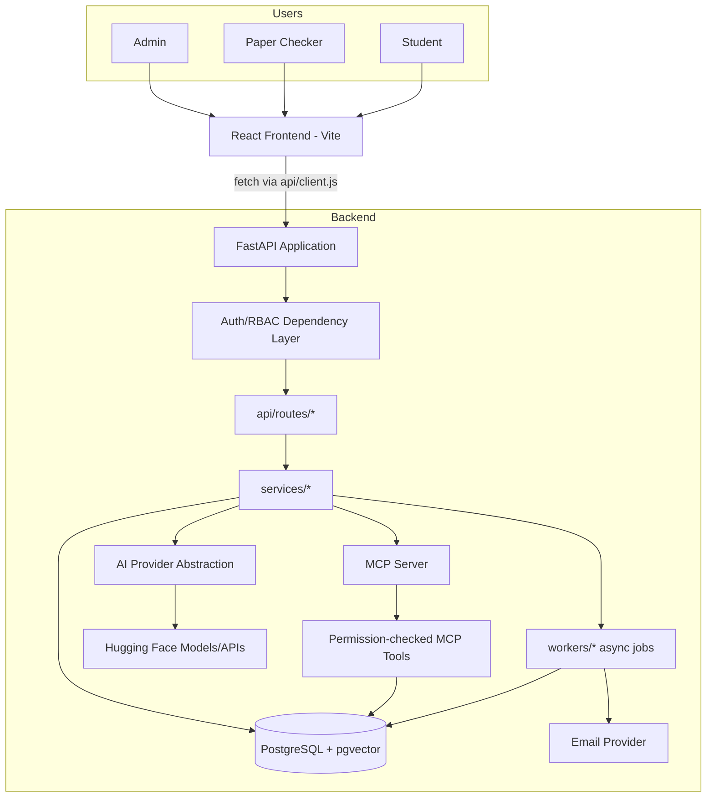
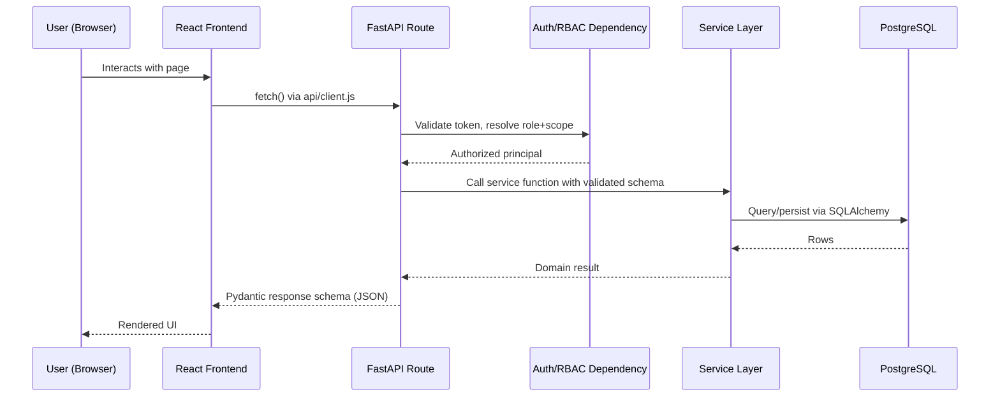
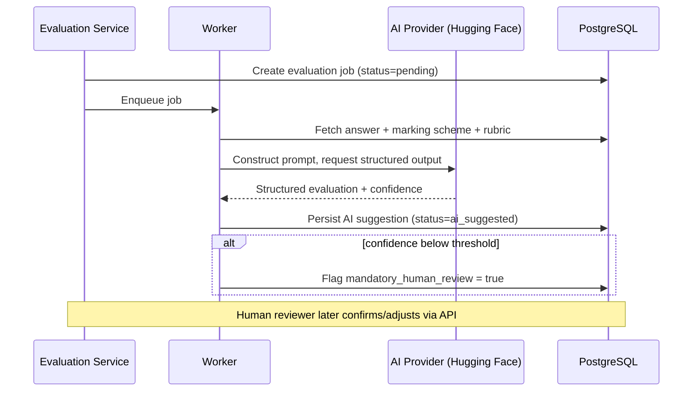
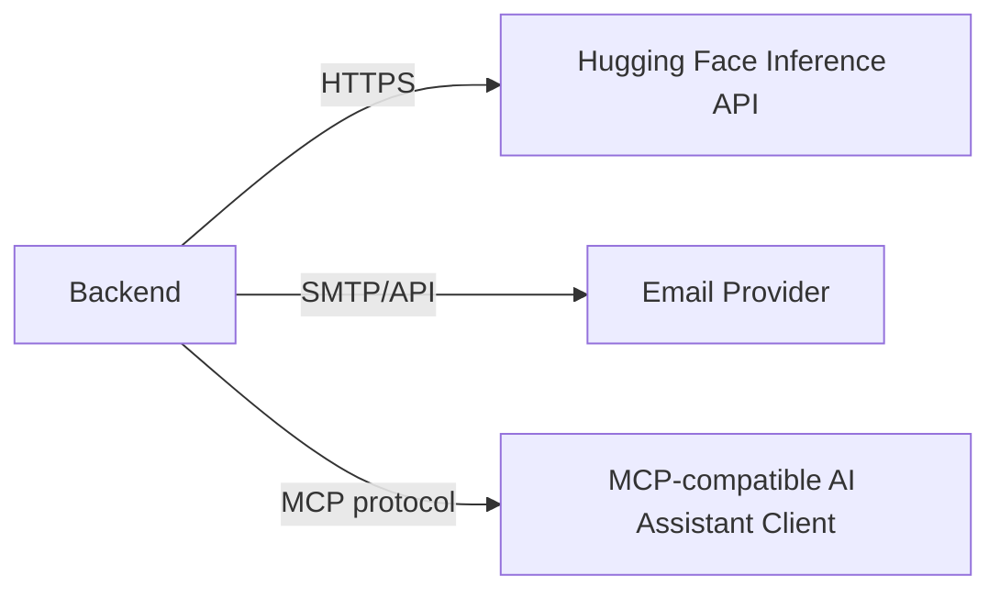

# 03 — System Architecture

## Status
🟢 Confirmed (component list, technology stack) · 🟡 Proposed (exact worker topology, pgvector usage)

## 1. Logical Architecture

## 2. Component Responsibilities

| Component | Responsibility |
|---|---|
| React Frontend | UI rendering, routing, calling backend only through `api/client.js` |
| FastAPI Application | HTTP entrypoint, request lifecycle |
| Auth/RBAC Dependency Layer | Authentication + role/scope authorization on every protected route |
| `api/routes/*` | Thin HTTP handlers: parse/validate request, call service, return schema |
| `services/*` | Business logic, orchestration, transactions |
| `db/models/*` | SQLAlchemy ORM models (persistence shape) |
| `schemas/*` | Pydantic request/response contracts |
| `workers/*` | Async/background jobs (OCR, AI evaluation, email delivery, analytics rollups) |
| AI Provider Abstraction | Decouples services from a specific Hugging Face model/endpoint |
| MCP Server | Exposes controlled tools to the AI assistant; enforces per-call authorization |
| PostgreSQL (+ optional pgvector) | System of record; vector search for question-bank similarity/duplicate detection (🟡 proposed) |
| Email Provider | Abstracted inbound/outbound email integration |

## 3. Runtime Architecture (Docker Compose)

See `24-deployment-and-infrastructure.md` for full detail. Summary: `frontend`, `backend`, `db` (PostgreSQL), and optionally a `worker` service, all defined in `docker-compose.yml` at repo root.

## 4. Request Flow (synchronous)

## 5. AI Evaluation Flow (asynchronous)

## 6. Data Flow Summary

- **Write path:** Frontend → API → Service → SQLAlchemy → PostgreSQL.
- **AI path:** Service enqueues → Worker → AI Provider → structured result persisted → human review gate.
- **MCP path:** AI assistant → MCP tool call → permission check against caller's role/scope → read-only query against Service/DB layer → result returned to assistant context.
- **Notification path:** Service/Worker → Email Provider abstraction → delivery + retry + audit.

## 7. External Integration Flow

## 8. Why This Shape

- Business logic isolated in `services/` keeps routes thin and testable, and keeps AI/DB coupling out of the HTTP layer.
- The AI Provider abstraction (see `08-ai-evaluation-engine.md`) means a Hugging Face model can be swapped without touching services or routes.
- MCP tools sit behind the same authorization primitives as the REST API — no parallel, weaker permission path.
- Async workers keep OCR/AI calls off the request/response cycle, satisfying NFR-PERF-002.

## Open Questions
- ❓ Task queue technology for `workers/` (e.g., Celery, arq, RQ) — not yet selected.
- ❓ Whether pgvector is required for MVP or deferred to question-bank duplicate detection phase.
