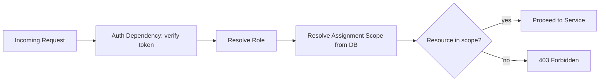

# 04 — User Roles and Access Control

## Status
🟢 Confirmed (role list, enforcement principle) · 🟡 Proposed (exact permission matrix)

## 1. Roles

### Admin
Responsibilities:
- User management (create/deactivate accounts, assign roles)
- Create/manage academic structure (departments, subjects, academic years)
- Create Paper Checker assignments and deadlines
- Monitor system-wide progress and overdue items
- Review escalated/high-seriousness student queries
- Review audit logs
- General system administration

### Paper Checker (Departmental User)
Responsibilities:
- Author, review, and version question papers within assigned scope
- Evaluate answer papers within assigned scope (accept/adjust/reject AI suggestions)
- View analytics for own assigned subjects/departments
- Use the AI assistant restricted to their scope
- Respond to student queries routed to their scope

### Student
Responsibilities (architected for; MVP surface may be reduced — see `01-project-vision-and-scope.md`):
- Submit academic queries
- View own published results
- View own performance feedback (post-MVP)

## 2. Role vs Scope

- **Role** answers "what *kind* of actions can this user attempt?"
- **Scope** answers "*which* data can this user act on?"

Example: a Paper Checker's role grants evaluation permission; their scope restricts it to, e.g., `CSE + Data Structures + Second Year`. A Paper Checker must never be able to evaluate a paper outside their assigned (department, subject, academic_year) tuple, even though their role permits evaluation generically.

## 3. Permission Matrix (Proposed)

| Action | Admin | Paper Checker (in scope) | Paper Checker (out of scope) | Student |
|---|---|---|---|---|
| Manage users | ✅ | ❌ | ❌ | ❌ |
| Create academic structure | ✅ | ❌ | ❌ | ❌ |
| Create assignment | ✅ | ❌ | ❌ | ❌ |
| Author question paper | ✅ | ✅ | ❌ | ❌ |
| Approve question paper | ✅ | 🟡 (proposed: senior role only) | ❌ | ❌ |
| Upload answer papers | ✅ | ✅ | ❌ | ❌ |
| Evaluate answer papers | ✅ | ✅ | ❌ | ❌ |
| View department analytics | ✅ | ✅ (own scope only) | ❌ | ❌ |
| View own results | — | — | — | ✅ |
| Submit query | — | — | — | ✅ |
| Respond to query | ✅ | ✅ (routed to scope) | ❌ | ❌ |
| Review audit log | ✅ | ❌ | ❌ | ❌ |
| Use AI assistant | ✅ | ✅ (scoped tools only) | — | ❌ (MVP) |

## 4. Data Visibility Rules

- A Paper Checker never sees answer papers, marks, or analytics outside their assignment scope.
- A Student sees only their own records; never another student's marks or queries.
- Admin has system-wide read access but mark *finalization* still requires the assigned Paper Checker unless explicitly reassigned.

## 5. Enforcement at Two Levels

### UI Level
- Navigation and actions are hidden/disabled based on role and scope, for usability only.

### Backend Enforcement Level (authoritative)
- Every route in `backend/app/api/routes/` depends on an auth dependency that resolves the authenticated principal's role and scope.
- Every service function that touches scoped data (assignments, papers, queries) re-validates the caller's scope against the target resource — never trusts the frontend.
- MCP tools perform the identical scope check before executing (see `11-mcp-ai-assistant.md`).

> **NFR-SEC-001 (restated):** UI-only restriction is never sufficient. Frontend hiding is a UX convenience; the backend is the only authority.

## 6. Session/Scope Resolution Flow

## Open Questions
- ❓ Does question-paper *approval* require a distinct "Senior Paper Checker" or "HOD" sub-role, or is Admin the only approver?
- ❓ Exact student-facing permission set for MVP.
