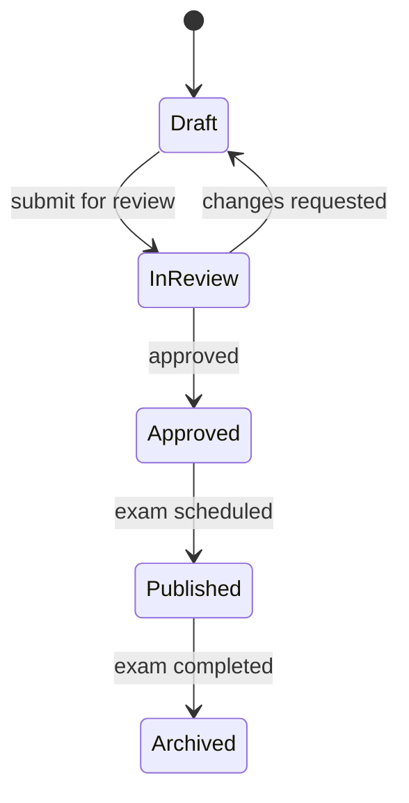

# 06 — Question Paper Management

## Status
🟢 Confirmed (lifecycle) · 🟡 Proposed (AI generation, duplicate detection)

## 1. Purpose

Give Paper Checkers a structured, reusable way to author question papers mapped to syllabus/unit/learning outcomes, with a review/approval gate before publication.

## 2. Core Concepts

- **Question Bank** — a persistent store of authored questions, reusable across papers/years.
- **Syllabus/Subject/Unit Mapping** — every question links to a subject and unit; optionally a learning outcome.
- **Difficulty & Bloom's Taxonomy** — optional metadata (`easy/medium/hard`, `remember/understand/apply/analyze/evaluate/create`) used later for analytics and balanced-paper assembly.
- **Marks** — per-question mark value; paper total is derived, not independently entered.
- **Versioning** — every edit after initial draft creates a new version; prior versions are retained for audit and re-evaluation reference.

## 3. Lifecycle

## 4. Question Types

- 🟢 Confirmed: descriptive/long-answer, short-answer.
- 🟡 Proposed: MCQ, numerical.

## 5. Question Bank & Previous-Question Retrieval

- Paper Checkers can search the question bank by subject/unit/keyword when authoring a new paper.
- 🟡 Proposed: semantic similarity search (via pgvector embeddings) to surface previously used or similar questions and flag likely duplicates before a paper is finalized. This is assistive only — a human decides whether to keep, edit, or discard a flagged duplicate.

## 6. AI's Role (Explicit)

| Step | AI Usage | Human Control |
|---|---|---|
| Draft question generation | 🟡 Proposed — AI drafts candidate questions from a syllabus topic prompt | Paper Checker must edit/approve every AI-drafted question before it enters the bank |
| Duplicate detection | 🟡 Proposed — embedding similarity search flags likely duplicates | Human decides to keep/discard |
| Difficulty estimation | 🟡 Proposed — AI can suggest a difficulty label | Human can override |

AI never publishes a question paper. Publication always requires human approval (workflow 4 in `05-end-to-end-user-workflows.md`).

## 7. Approval Workflow

1. Paper Checker authors paper in Draft state.
2. Submits for review → `InReview`.
3. Reviewer (Admin or, 🟡 proposed, a senior/HOD role) approves or requests changes.
4. On approval, paper moves to `Approved`; becomes `Published` once tied to a scheduled examination.

## 8. Data Touchpoints (forward reference — see `13-database-data-model.md`)

- `question_papers` (header: subject, academic_year, status, version)
- `questions` (belongs to a question_paper OR standalone in the bank)
- `question_paper_versions` (🟡 proposed, for full version history)

## Open Questions
- ❓ Is AI question generation in scope for any near-term phase, or strictly Future?
- ❓ Who approves a question paper — Admin only, or a dedicated reviewer role?
- ❓ Embedding model for duplicate detection (see `08-ai-evaluation-engine.md` AI provider notes).
