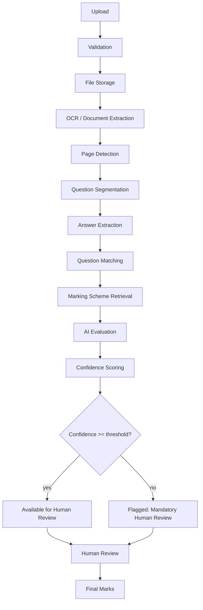

# 07 — Answer Paper Processing and Evaluation

## Status
🟢 Confirmed (pipeline stages, human-review gate) · 🟡 Proposed (OCR engine, exact confidence formula)

This is one of the deepest documents in the system. Every stage below is a distinct, independently testable unit.

## 1. Full Pipeline

## 2. Stage-by-Stage Detail

### 2.1 Upload
- Actor uploads one or more scanned/digital answer papers (PDF/image) per student per examination.
- Handled by `routes/answer_papers.py`; delegates to `services/answer_paper_service.py`.
- Rejects unsupported types immediately at the API boundary (see `17-file-upload-and-document-processing.md`).

### 2.2 Validation
- File type, size limit, page count sanity check.
- Malware/corruption scan (🟡 proposed tool: Open Question).
- On failure: upload rejected with a specific error, nothing persisted beyond an audit record of the rejected attempt.

### 2.3 File Storage
- Stored in a content-addressed or UUID-named location; original filename retained as metadata only, never trusted as an identifier.
- 🟡 Proposed: object storage (local volume for MVP, S3-compatible for production — see Open Questions in `24-deployment-and-infrastructure.md`).

### 2.4 OCR / Document Extraction
- Converts scanned images/PDF pages into extracted text plus positional metadata.
- Engine: ❓ Open Question (candidates: Tesseract, a Hugging Face OCR model, or a managed OCR API).
- Output persisted as raw extraction, separate from any downstream interpretation, so OCR errors are diagnosable independently of evaluation errors.

### 2.5 Page Detection
- Identifies script boundaries: which pages belong to which student's script when scripts are batch-scanned.
- Errors here are high-impact (misattributed scripts); flagged for mandatory human verification when confidence is low.

### 2.6 Question Segmentation
- Splits extracted text into per-question segments, using question numbers/markers written by the student and/or layout cues.
- Ambiguous segmentation (e.g., unclear question numbering) is flagged for human resolution rather than guessed silently.

### 2.7 Answer Extraction
- Produces a clean per-question answer text block, ready for AI evaluation.

### 2.8 Question Matching
- Matches the segmented answer to the corresponding question in the approved question paper (by question number, with fallback matching if numbering is inconsistent).

### 2.9 Marking Scheme Retrieval
- Fetches the rubric/marking scheme tied to the matched question from `services/question_paper_service.py` / rubric storage.
- If no marking scheme exists, evaluation cannot proceed automatically — flagged for manual grading.

### 2.10 AI Evaluation
- See `08-ai-evaluation-engine.md` for full detail on prompt construction, structured output, and the `AIProvider` abstraction.

### 2.11 Confidence Scoring
- AI evaluation returns a confidence value alongside suggested marks.
- 🟡 Exact formula is an Open Question; conceptually a function of model self-reported certainty, answer/rubric ambiguity, and OCR extraction confidence.

### 2.12 Human Review Gate
- **FR-EVAL-004 / FR-EVAL-005**: every AI suggestion requires human confirmation before becoming a final mark; suggestions below the confidence threshold are additionally flagged as mandatory review (cannot be bulk-accepted).

## 3. Error Handling

| Failure | Handling |
|---|---|
| Corrupted/unreadable file | Reject at validation; notify uploader |
| OCR extraction fails or low quality | Mark answer paper `needs_manual_transcription`; human can re-upload or transcribe |
| Page/script misattribution suspected | Flag for manual script-boundary verification |
| No marking scheme found | Evaluation blocked; task queued for manual grading |
| AI model call fails/times out | Job retried with backoff (see `08-ai-evaluation-engine.md` §Retry Behavior); after max retries, status becomes `ai_unavailable`, routed to full manual evaluation |
| Confidence below threshold | Never silently finalized — always routed to mandatory human review |

## 4. Data Touchpoints
- `answer_papers`, `answer_pages`, `answers`, `evaluations`, `evaluation_criteria`, `ai_execution_records` (see `13-database-data-model.md`).

## Open Questions
- ❓ OCR engine selection.
- ❓ Malware/corruption scanning tool for uploads.
- ❓ Exact confidence-score formula (also referenced in `21-ai-reliability-and-human-review.md`).
- ❓ Object storage backend for production.
