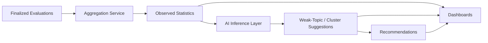

# 09 — AI Analytics and Learning Insights

## Status
🟢 Confirmed (evidence/inference/recommendation separation) · 🟡 Proposed (specific algorithms)

## 1. Three Categories of Output — Never Blur Them

| Category | Definition | Example |
|---|---|---|
| **Observed Evidence** | Deterministic aggregation of finalized (human-confirmed) marks. No AI involved. | "62% of students scored below 50% on Q4 (Unit 3: Sorting Algorithms)." |
| **AI Inference** | A pattern or grouping the AI derives from observed evidence — a hypothesis, not a fact. | "These low scores likely cluster around a misunderstanding of algorithm complexity analysis." |
| **Recommendation** | An AI- or system-generated suggested action based on inference. | "Consider a remedial session on Big-O analysis before the next assessment." |

The UI and API responses must label which category each figure belongs to (see `16-frontend-architecture.md`). **AI inference is never presented as fact.**

## 2. Statistics Computed (Observed Evidence)

- Question-level: average score, score distribution, pass rate.
- Topic/unit-level: aggregated across questions mapped to that unit.
- Class-level: aggregated across a section/batch.
- Department-level: aggregated across subjects within a department.

All computed only from `evaluations` with `finalized_at IS NOT NULL` — AI-suggested-but-not-yet-confirmed marks are excluded from evidence statistics.

## 3. AI Inference Layer

- **Weak-topic detection** — 🟡 Proposed: statistical thresholding (e.g., topics where mean score falls below a configurable percentage) refined by an AI pass that groups related low-performing questions conceptually.
- **Concept clustering** — 🟡 Proposed: groups questions/answers by underlying concept using embeddings, to detect that failures share a root cause even across different question wordings.
- **Common errors** — 🟡 Proposed: AI summarizes recurring mistake patterns from evaluation rationales (`criterion_scores[].rationale` from `08-ai-evaluation-engine.md`).
- **Performance trends** — comparison across academic terms/years (evidence-level, computed, not inferred).
- **Recommendations** — generated from inference layer; always labeled as suggestions, always reviewable/dismissible by a human.

## 4. Pipeline

## 5. Guardrails

- Inference and recommendation outputs are always tagged with the `ai_execution_record` that produced them (traceable, versioned — see `20-audit-logging-and-accountability.md`).
- No inference output feeds back into a student's official record or grade — it is diagnostic/advisory only.
- A human (Paper Checker/Admin) can dismiss or flag an AI inference as inaccurate; dismissed inferences are excluded from future aggregate reporting but retained for audit.

## Open Questions
- ❓ Exact weak-topic statistical threshold.
- ❓ Embedding model for concept clustering (see also `13-database-data-model.md` pgvector notes).
- ❓ Refresh cadence for analytics (real-time vs scheduled rollup).
