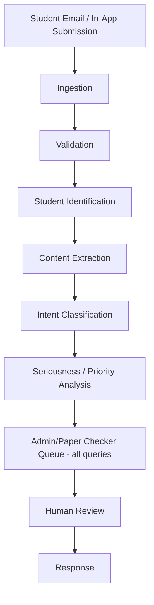

# 10 — Student Query and Seriousness Analysis

## Status
🟢 Confirmed (no-auto-dismissal principle) · 🟡 Proposed (scoring formula, thresholds)

## 1. Pipeline

## 2. Stage Detail

### 2.1 Ingestion
- Inbound channel: email (via `12-email-and-notification-system.md` provider abstraction) and/or in-app form (🟢 in-app confirmed for MVP, 🟡 email ingestion timeline open).

### 2.2 Validation
- Confirms sender is a recognized student identity (or captures as "unverified" pending manual match).
- Rejects spam/malformed content at this stage; rejection is logged, not silently dropped.

### 2.3 Student Identification
- Matches sender (email address or authenticated session) to a `students` record. Ambiguous matches are queued for manual identity confirmation rather than guessed.

### 2.4 Content Extraction
- Extracts subject/body text (and attachments, subject to `17-file-upload-and-document-processing.md` handling).

### 2.5 Intent Classification
- 🟡 Proposed: AI classifies the query into categories (e.g., `mark_dispute`, `re_evaluation_request`, `general_doubt`, `administrative`, `complaint`) to route to the right queue/owner.

### 2.6 Seriousness / Priority Analysis
- AI produces a priority score used **only to order the queue**, never to filter it.

## 3. Seriousness Score — Design Requirements

- **Score range:** 🟡 Proposed 0–100 (or a low/medium/high categorical band — Open Question on final representation).
- **Feature inputs (configurable, proposed candidates):**
  - Intent classification category (e.g., a formal grievance ranks higher than a general doubt).
  - Sentiment/urgency language cues.
  - Repeated contact on the same subject (a student who has queried multiple times unanswered ranks higher).
  - Deadline proximity (e.g., a re-evaluation request near a results-lock deadline ranks higher).
- **Explainability:** every score is stored with the feature values that produced it, so a human reviewer can see *why* a query was ranked where it was — never a black-box number alone.
- **Threshold configuration:** band cutoffs (e.g., what counts as "high priority") are configurable, not hardcoded, and live under `backend/app/core/config.py`-sourced settings.

## 4. Non-Negotiable Rule

> **Do NOT create an automatic system that blindly dismisses students based solely on AI. Low-priority queries must still be handled appropriately.**

Concretely:
- Every query — regardless of score — is inserted into the human-reviewable queue (`FR-QUERY-003`).
- The score affects **ordering and SLA expectations**, never eligibility for a response.
- There is no code path that closes or auto-responds to a query without a human action, except an explicit, human-configured auto-acknowledgment ("we received your query") which is distinct from a substantive response.

## 5. False Positives / False Negatives

- **False positive** (over-flagged as serious): wastes reviewer attention but causes no harm to the student — acceptable failure mode to bias toward.
- **False negative** (under-flagged, actually serious): mitigated by (a) every query still reaching a human queue, just lower in order, and (b) an SLA-based escalation — a query unresponded to past a configurable time threshold is automatically bumped in priority regardless of its original AI score.

## 6. Human Override

- Any reviewer can manually change a query's priority band, with the change recorded in the audit log (`query.priority_overridden`).

## Open Questions
- ❓ Score scale (numeric vs categorical) — final representation.
- ❓ Exact feature weighting formula.
- ❓ SLA escalation time threshold.
- ❓ Email ingestion timeline (inbound email parsing infra).
