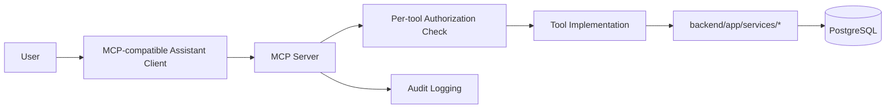

# 11 — MCP AI Assistant

## Status
🟡 Proposed (entire feature is post-MVP) — documented now so the architecture accommodates it without rework.

## 1. Purpose

Give Admin and Paper Checker users a conversational assistant that can answer questions about *their own scoped data* ("What's my class average on Unit 3?", "Draft a reply to this student query", "Which papers are overdue for review?") without giving the underlying LLM direct database or filesystem access.

## 2. Architecture

The MCP server is a thin, permission-aware wrapper around the **same** service layer used by the REST API. It never queries the database directly and never executes free-form SQL.

## 3. Core Principle

> **Do not give the LLM unrestricted SQL/database access. Every MCP tool must verify user permissions.**

Each tool:
1. Receives the calling user's authenticated identity (passed through from the MCP session, not trusted from the LLM's free-text).
2. Resolves that user's role and scope exactly as the REST auth dependency does (`04-user-roles-and-access-control.md`).
3. Rejects (with a clear error, not a silent empty result) any request outside that scope.
4. Calls into `services/*` — never a raw query — so the same business rules (e.g., only finalized marks count as evidence) apply identically to MCP and REST.

## 4. Proposed Tool Catalog

| Tool | Purpose | Scope Enforcement |
|---|---|---|
| `get_assigned_departments` | List departments the caller is assigned to | Filtered to caller's assignments |
| `get_assigned_subjects` | List subjects the caller is assigned to | Filtered to caller's assignments |
| `get_exam_details` | Retrieve exam metadata | Caller's scope only |
| `get_question_paper` | Retrieve a question paper | Caller's scope only |
| `get_marking_scheme` | Retrieve rubric for a question | Caller's scope only |
| `get_student_performance` | Retrieve a student's finalized results | Caller's scope only; never cross-department |
| `get_class_statistics` | Aggregated class performance | Caller's scope only |
| `get_question_statistics` | Aggregated question-level stats | Caller's scope only |
| `get_topic_weakness` | AI-inferred weak topics (labeled as inference) | Caller's scope only |
| `search_previous_questions` | Query bank search | Caller's scope only |
| `generate_performance_report` | Compile a report from evidence + inference | Caller's scope only |
| `draft_student_email` | Draft (not send) a response to a query | Caller's scope only; drafting only, never auto-sends |
| `get_pending_reviews` | List evaluations awaiting the caller's review | Caller's own queue |
| `get_deadline_status` | List deadlines relevant to caller | Caller's scope only |

All tools are **read/draft only** except in explicitly reviewed future extensions; none finalizes marks, sends communications, or modifies academic records directly (consistent with `44` — human authority principle).

## 5. Tool Schema Discipline

Every tool has:
- A strict input schema (Pydantic) — no freeform query strings that could be reinterpreted as SQL or shell commands.
- A strict output schema — structured data, not the assistant improvising phrasing over unvalidated raw content.

## 6. Prompt Injection Protection

- Tool outputs are treated as *data*, not *instructions* — the assistant framework must not let content returned from a tool (e.g., a student's query text) be interpreted as new instructions to the assistant.
- User-supplied content flowing into any tool argument is validated against the tool's schema before execution; it cannot alter which tool runs or its permission context.
- The calling user's role/scope is derived server-side from the authenticated session — never taken from the conversation text.

## 7. Auditability

- Every MCP tool invocation is logged: caller identity, tool name, arguments (sanitized of any large payload), scope check result, and outcome — same audit substrate as `20-audit-logging-and-accountability.md`.

## Open Questions
- ❓ Which MCP client(s) will connect (Claude, another assistant, an internal chat UI)?
- ❓ Whether `draft_student_email` output requires an explicit additional confirmation step before a human can send it (recommended: yes).
- ❓ Rate limiting for MCP tool calls per user/session.
