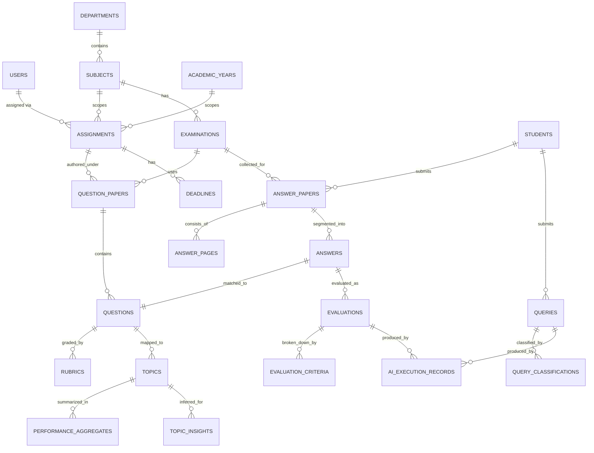

# 13 — Database Data Model

## Status
🟢 Confirmed (core entities, rationale) · 🟡 Proposed (exact column lists, pgvector usage)

## 1. Design Principles

- Every entity below exists to serve a specific workflow in `05-end-to-end-user-workflows.md`; none is included speculatively.
- Finalized academic data (marks) is immutable once `finalized_at` is set; corrections happen via a new audited revision, not an in-place overwrite (see `20-audit-logging-and-accountability.md`).
- AI-generated content is always stored separately from human-confirmed content, with a traceable link between them.

## 2. Entity Overview

| Entity | Why it exists |
|---|---|
| `users` | Authentication identity for Admin/Paper Checker/Student |
| `roles` | Coarse permission category |
| `departments` | Organizational unit |
| `subjects` | Academic subject, belongs to a department |
| `academic_years`, `semesters` | Temporal scoping for assignments/exams |
| `assignments` | Binds a Paper Checker to (department, subject, academic_year) — the scope primitive |
| `examinations` | An exam event tied to a subject/academic_year |
| `question_papers` | Header for an authored paper (status, version) |
| `questions` | Individual questions, reusable across papers (question bank) |
| `rubrics` / `marking_schemes` | Grading criteria tied to a question |
| `students` | Student identity + enrollment info |
| `answer_papers` | An uploaded script for one student/exam |
| `answer_pages` | Per-page OCR/extraction record |
| `answers` | Segmented per-question answer extracted from a script |
| `evaluations` | AI-suggested and human-finalized marks for one answer |
| `evaluation_criteria` | Per-rubric-criterion score breakdown for an evaluation |
| `topics` | Syllabus topic/unit taxonomy used for analytics |
| `performance_aggregates` | Computed observed-evidence statistics |
| `topic_insights` | AI-inferred weak-topic/clustering output (never merged into evidence tables) |
| `queries` | Student query record |
| `query_classifications` | AI intent/seriousness classification for a query |
| `notifications` | Outbound/inbound notification log |
| `deadlines` | Deadline tracking tied to assignments/exams |
| `audit_logs` | Immutable record of consequential actions |
| `ai_execution_records` | Every AI model invocation: input reference, output, model/prompt version, confidence |

## 3. Key Relationships (Simplified ER)

## 4. Notable Constraints & Indexes (Proposed)

- `assignments (paper_checker_id, department_id, subject_id, academic_year_id)` — unique constraint; this tuple is the scope primitive referenced throughout `04-user-roles-and-access-control.md`.
- `evaluations.finalized_at` — nullable; once set, the row (and its `evaluation_criteria`) becomes append-only for corrections (a correction creates a new linked evaluation revision, not an overwrite).
- Index on `answers (question_id)`, `evaluations (answer_id)`, `queries (status, priority_score)` for queue ordering.
- `ai_execution_records` always stores `model_identifier` and `prompt_version` — required for reproducibility (`21-ai-reliability-and-human-review.md`).

## 5. Lifecycle & Deletion Behavior

- **Users/students:** soft-deleted (deactivated), never hard-deleted, to preserve referential integrity of historical evaluations/audit logs.
- **Question papers:** versioned, not deleted; an obsolete version is archived, not removed.
- **Answer papers/evaluations:** never deleted after finalization; retention policy is an Open Question (see below).
- **Audit logs:** append-only, never deleted or edited by application code.

## 6. Sensitive Fields

- `students.pii_*` fields (name, contact info) — access restricted per `19-security-and-data-privacy.md`.
- `answer_papers.file_reference` — access-controlled; never exposed via a public/unauthenticated URL.
- `queries.body` — may contain sensitive personal/academic grievance content; visibility restricted to scope.

## 7. Vector Search (pgvector)

- 🟡 Proposed: `questions.embedding` (vector column) for duplicate-detection/similarity search (`06-question-paper-management.md`), and optionally `answers.embedding` or `topic_insights` supporting data for concept clustering (`09-ai-analytics-and-learning-insights.md`).
- Not required for MVP; introduce only when the question-bank duplicate-detection feature is actually implemented (per master-prompt guidance: don't blindly implement all entities).

## Open Questions
- ❓ Retention policy for answer papers/evaluations after a program/academic-year closes.
- ❓ Exact embedding model/dimension for pgvector columns.
- ❓ Whether `students` is a subtype of `users` or a separate table linked 1:1 (recommendation: separate table, since not all students may have login accounts in early phases).
