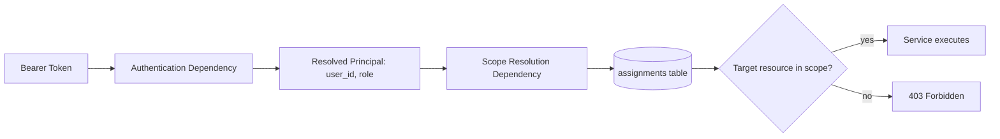

# 18 — Authentication and Authorization

## Status
🟢 Confirmed (role/scope model, backend-enforcement principle) · 🟡 Proposed (token mechanism specifics)

## 1. Login & Credentials

- Users authenticate with institutional email + password (`FR-AUTH-001`).
- Passwords are hashed using a strong, salted algorithm (🟡 proposed: bcrypt/argon2 — final choice Open Question) — never stored or logged in plaintext.

## 2. Tokens / Sessions

- 🟡 Proposed: JWT bearer tokens with a short-lived access token and a refresh mechanism, or server-side session tokens — final mechanism is an Open Question, to be captured as an ADR once decided (see `42` governing rules).
- Tokens/sessions expire after a configurable idle period (`FR-AUTH-003`), sourced from `backend/app/core/config.py`.

## 3. Role-Based Access Control (RBAC)

- Every authenticated principal has exactly one role: Admin, Paper Checker, or Student (see `04-user-roles-and-access-control.md`).
- Role determines *which categories* of action are permitted.

## 4. Scope-Based Access

- Scope determines *which specific data* a role's permissions apply to.
- For Paper Checkers, scope is the set of `assignments` rows: (department, subject, academic_year).
- Example: a Paper Checker may evaluate papers, but only for `CSE + Data Structures + Second Year` — an attempt to evaluate a paper in `ECE + Signals + Second Year` is rejected at the service layer regardless of role.

## 5. Role vs Scope — Summary

| Concept | Answers | Example |
|---|---|---|
| Role | What kind of action? | "Can evaluate answer papers" |
| Scope | On what data? | "Only CSE / Data Structures / 2nd Year" |

## 6. Backend Authorization Enforcement

- Implemented as FastAPI dependencies attached to every protected route in `backend/app/api/routes/`.
- Service-layer functions that accept a `resource_id` independently re-validate scope against the resolved principal — routes never assume the dependency alone is sufficient if a service function could be called from multiple entry points (defense in depth).

## 7. Frontend vs Backend

- Frontend (`ScopeContext`, `ProtectedRoute`) hides/disables UI for UX only.
- Backend is the sole authority — see `NFR-SEC-001`.

## 8. Logout / Session Expiry

- Explicit logout invalidates the current token/session server-side (not just client-side token discard) if a session-store mechanism is used; for stateless JWTs, logout is client-side discard plus short token lifetime (🟡 depends on final token mechanism decision).
- Idle expiry enforced server-side regardless of client behavior.

## Open Questions
- ❓ JWT vs server-side session — final mechanism (ADR required).
- ❓ Password hashing algorithm (bcrypt vs argon2).
- ❓ Refresh token strategy if JWT is chosen.
- ❓ Multi-factor authentication — in scope for any phase?
