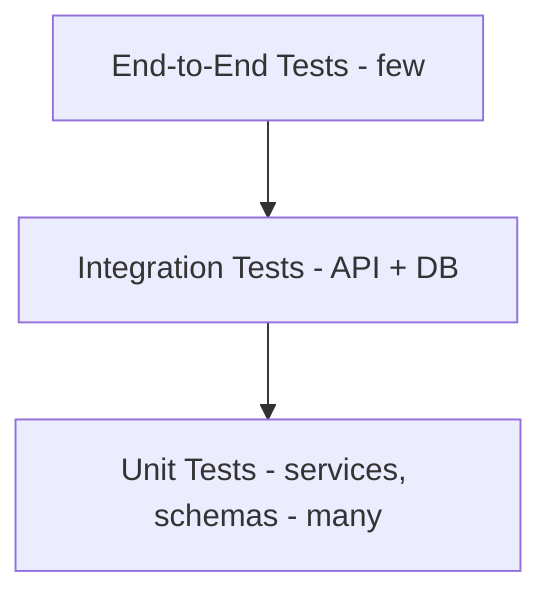

# 22 — Testing and Quality Strategy

## Status
🟢 Confirmed (test categories, critical cases) · 🟡 Proposed (tooling/coverage targets)

## 1. Test Pyramid



## 2. Test Categories

| Category | Location | Focus |
|---|---|---|
| Unit tests | `backend/tests/services/`, `backend/tests/schemas/` | Business logic in isolation, mocked `AIProvider`/`EmailProvider` |
| Integration tests | `backend/tests/api/` | Route → service → test DB, real request/response cycle |
| API/contract tests | `backend/tests/api/` | Request/response schema conformance, status codes |
| Frontend tests | `frontend/src/**/__tests__` (🟡 proposed tooling: Vitest + React Testing Library) | Component rendering, `api/client.js` mocking |
| Database tests | `backend/tests/db/` | Constraint enforcement, migration correctness |
| AI evaluation tests | `backend/tests/services/test_ai_evaluation_service.py` | `AIProvider` mocked with deterministic fixtures; confidence-threshold routing logic |
| Authorization tests | `backend/tests/api/test_authz.py` (🟡 proposed) | Role + scope enforcement, explicitly including negative cases |
| Security tests | `backend/tests/security/` (🟡 proposed) | Injection attempts, file-upload abuse, auth bypass attempts |
| File-processing tests | `backend/tests/services/test_file_processing.py` | Validation, corrupted files, OCR pipeline stages (mocked OCR engine) |
| MCP tests | `backend/tests/mcp/` (post-MVP) | Tool-level authorization, schema enforcement |
| End-to-end tests | 🟡 Proposed (Playwright/Cypress) | Full workflows from `05-end-to-end-user-workflows.md` |

## 3. Critical Test Cases (Must Exist)

### Authorization
```text
Given: Paper Checker assigned only to (CSE, Data Structures, 2024)
When: they request an evaluation belonging to (ECE, Signals, 2024)
Then: 403 Forbidden, and no data leaks in the error response
```

### AI Confidence Routing
```text
Given: an AI evaluation result with confidence below the configured threshold
When: the evaluation is persisted
Then: it is flagged mandatory_human_review = true
And: it cannot be bulk-accepted via any batch-confirm endpoint
```

### Human Authority
```text
Given: an evaluation with an AI-suggested mark
When: no human has confirmed it
Then: evaluations.finalized_at remains null
And: it is excluded from analytics evidence aggregation (09-ai-analytics...)
```

### Query Non-Dismissal
```text
Given: a student query classified with the lowest possible seriousness score
When: classification completes
Then: the query still appears in the human-reviewable queue
And: no automated path can set its status to "closed" without a human actor_user_id
```

### File Upload Safety
```text
Given: an uploaded file with a mismatched MIME type / extension
When: validation runs
Then: the upload is rejected with a specific error
And: no processing (OCR, storage beyond the rejected-attempt log) occurs
```

### Audit Immutability
```text
Given: an existing audit_logs row
When: any application code path attempts to update or delete it
Then: this is not a possible operation (enforced by not exposing such an operation, and 🟡 proposed DB-level protection)
```

## 4. Coverage & CI

- CI pipeline defined in `.github/workflows/ci.yml`; runs backend tests (`pytest`) and 🟡 proposed frontend tests on every PR.
- 🟡 Proposed coverage target: Open Question (recommend starting with a directional target on `services/` and `schemas/`, not a blanket repo-wide percentage).

## Open Questions
- ❓ Frontend test tooling final selection.
- ❓ E2E test tooling and which workflows are covered first.
- ❓ Coverage threshold policy.
- ❓ DB-level (not just application-level) protection for audit-log immutability.
