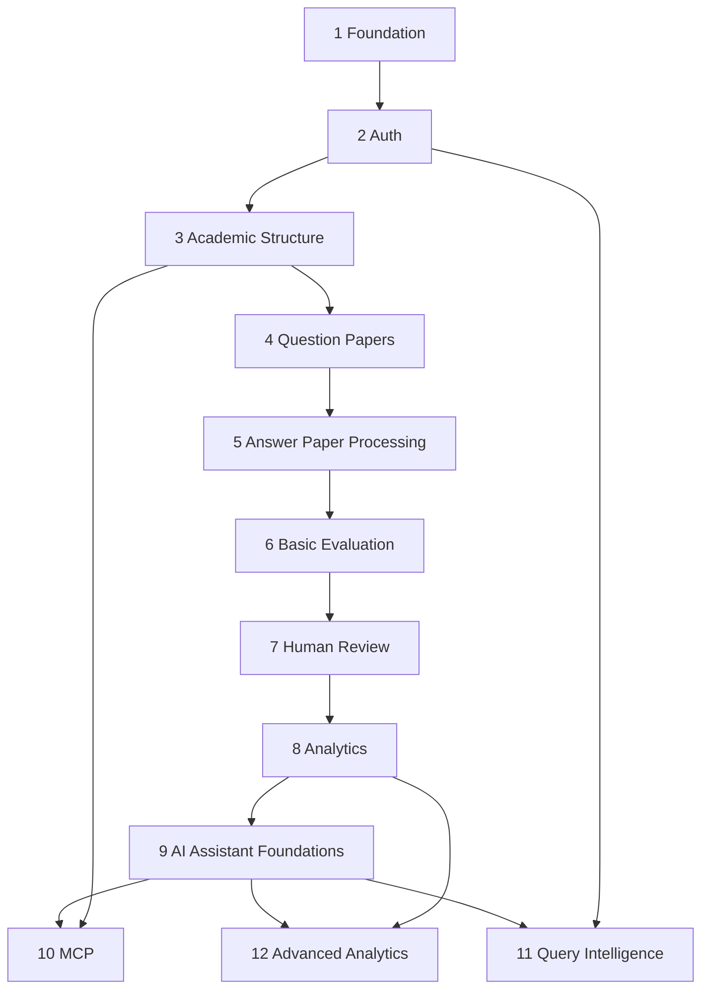

# 23 — Development Roadmap

## Status
🟡 Proposed — phasing and dependencies; not a committed schedule.

## 1. Phases

### Phase 1 — Foundation
- Repository scaffolding (already established per `03-system-architecture.md` / `14-backend-architecture.md`).
- `backend/app/core/config.py` settings model.
- Docker Compose baseline (backend, frontend, db).
- CI pipeline skeleton (`.github/workflows/ci.yml`).
- **Depends on:** nothing.

### Phase 2 — Authentication
- `users`, `roles` tables; login/logout endpoints; auth dependency.
- **Depends on:** Phase 1.

### Phase 3 — Academic Structure
- `departments`, `subjects`, `academic_years`, `assignments` (scope primitive).
- Role + scope authorization dependency fully wired.
- **Depends on:** Phase 2.

### Phase 4 — Question Paper Management
- `question_papers`, `questions`, `rubrics`; authoring/review/approval workflow.
- **Depends on:** Phase 3.

### Phase 5 — Answer Paper Processing
- Upload, validation, storage, OCR integration, segmentation, question matching.
- **Depends on:** Phase 4 (needs published question papers + marking schemes).

### Phase 6 — Basic Evaluation
- `AIProvider` abstraction + first concrete Hugging Face implementation.
- AI evaluation worker, confidence scoring, structured-output validation.
- **Depends on:** Phase 5.

### Phase 7 — Human Review
- Evaluation review UI/API, finalize-marks flow, mandatory-review routing.
- **Depends on:** Phase 6.

### Phase 8 — Analytics
- Observed-evidence aggregation (question/topic/unit/class/department).
- **Depends on:** Phase 7 (needs finalized marks).

### Phase 9 — AI Assistant Foundations
- AI inference layer for weak-topic detection (built on Phase 8 evidence).
- **Depends on:** Phase 8.

### Phase 10 — MCP
- MCP server, tool catalog, per-tool authorization.
- **Depends on:** Phase 3 (scope model) + relevant read services from Phases 4–9.

### Phase 11 — Query Intelligence
- Query ingestion (in-app first, email later), intent classification, seriousness scoring, human queue.
- **Depends on:** Phase 2 (auth) at minimum; benefits from Phase 9's AI inference patterns.

### Phase 12 — Advanced Analytics
- Concept clustering, embeddings/pgvector, trend analysis, recommendation refinement.
- **Depends on:** Phase 8, Phase 9.

## 2. Dependency Graph

## Open Questions
- ❓ Team capacity/timeline — this roadmap orders dependencies, not calendar dates.
- ❓ Whether Phase 10 (MCP) and Phase 11 (Query Intelligence) can run in parallel given team size.
