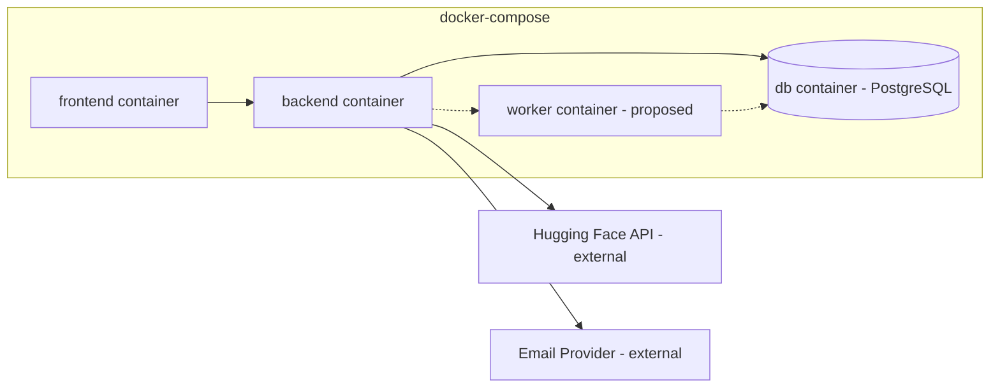

# 24 — Deployment and Infrastructure

## Status
🟢 Confirmed (Docker Compose topology) · 🟡 Proposed (production specifics)

## 1. Local/Dev Topology

```yaml
# docker-compose.yml (conceptual summary — see actual file at repo root)
services:
  backend:
    build: ./backend
    env_file: backend/.env
    depends_on: [db]
  frontend:
    build: ./frontend
    depends_on: [backend]
  db:
    image: postgres:<version>   # + pgvector extension if enabled
    volumes: [db_data:/var/lib/postgresql/data]
  # worker:   # 🟡 proposed, once task queue tech is selected
```



## 2. Frontend Container

- Builds the Vite production bundle, served via a lightweight static server (🟡 exact server: Open Question — e.g., nginx or `vite preview`-equivalent for production).

## 3. Backend Container

- Runs the FastAPI app (🟡 via uvicorn/gunicorn — final process manager Open Question).
- Reads all configuration from environment variables mapped into `backend/app/core/config.py` (`25-environment-and-configuration.md`).

## 4. PostgreSQL

- Single `db` service for MVP; `pgvector` extension enabled only if/when the question-bank similarity feature (`06-question-paper-management.md`) is implemented.
- 🟡 Proposed: scheduled backup job (`pg_dump` to a mounted/external volume) — schedule/retention Open Question.

## 5. Environment Configuration

- Each service reads its own `.env` (e.g., `backend/.env` from `backend/.env.example`); no shared global `.env` conflicting with `core/config.py`'s ownership of settings.

## 6. Networking

- Docker Compose's default bridge network; backend reaches `db` by service name (`db:5432`); frontend reaches backend via a configured API base URL (dev: direct container port; production: 🟡 reverse proxy — Open Question).

## 7. Production Considerations (Proposed, not committed)

- Reverse proxy/TLS termination (e.g., nginx or a managed load balancer) in front of frontend + backend.
- Externalized PostgreSQL (managed service) rather than a container volume, for durability.
- Object storage (S3-compatible) for answer-paper files instead of a local volume (`17-file-upload-and-document-processing.md`).
- Horizontal scaling of the backend behind a load balancer; workers scaled independently based on queue depth.

## 8. Logging

- 🟡 Proposed: container stdout/stderr aggregated by the hosting platform; structured JSON logs from the backend (see `NFR-OBS-001` — Open Question on exact stack).

## 9. Backups

- See §4 and Open Questions in `19-security-and-data-privacy.md`.

## 10. Scaling

- Kubernetes is explicitly **not** introduced without justification (per governing rules). Docker Compose remains the confirmed baseline; a move to an orchestrator is a Future/Open decision, not assumed.

## Open Questions
- ❓ Production process manager for FastAPI (uvicorn workers vs gunicorn+uvicorn workers).
- ❓ Reverse proxy/TLS setup for production.
- ❓ Managed vs containerized PostgreSQL in production.
- ❓ Backup schedule/retention.
- ❓ Logging/observability stack.
